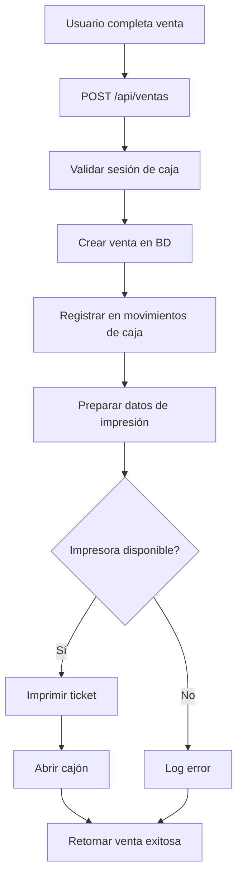

# 🖨️ Configuración de Impresora Térmica y Caja Registradora

## Resumen de la Implementación

Se ha convertido el código JavaScript a TypeScript e integrado con el sistema de ventas de AgroShop. La impresora se activará automáticamente después de cada venta exitosa.

## Archivos Creados/Modificados

### 1. **`lib/printer/escpos-printer.ts`** ✨ (NUEVO)
- Clase `ESCPOSPrinter` para manejar impresión térmica
- Función `getPrinter()` para obtener instancia singleton
- Métodos principales:
  - `printVentaAndOpenDrawer()`: Imprime ticket y abre cajón
  - `openDrawerOnly()`: Solo abre el cajón
  - `checkConnection()`: Verifica conectividad

### 2. **`app/api/ventas/route.ts`** 🔧 (MODIFICADO)
- Integrada impresión automática después de crear venta
- No interrumpe el flujo si falla la impresión
- Incluye datos de factura en el ticket

### 3. **`.env.example`** 📝 (ACTUALIZADO)
```env
PRINTER_PORT="COM3"
PRINTER_BAUD_RATE="9600"
```

### 4. **`scripts/test-printer.ts`** 🧪 (NUEVO)
- Script de prueba para verificar la impresora
- Ejecutar con: `npm run test:printer`

## Características Implementadas

### ✅ Impresión Automática
- Se imprime después de cada venta exitosa
- Incluye todos los items, totales, descuentos
- Muestra si requiere/generó factura

### ✅ Apertura de Cajón
- Se abre automáticamente con cada venta
- Comando ESC/POS estándar (pin 2)

### ✅ Manejo de Errores
- No interrumpe la venta si falla la impresión
- Logs detallados en consola
- Timeout de seguridad (30 segundos)

### ✅ Formato del Ticket
```
        AGROSHOP
  SENA Alto de Cauca, POPAYAN
    NIT: 123456789-0
--------------------------------------
Ticket: VTA-2024-001
Fecha: 12/12/2024 10:30 AM
Cliente: Juan Pérez
Factura: GENERADA
--------------------------------------
PRODUCTO              CANT   PRECIO
--------------------------------------
CAFE EXPRESS             2   $8,000
PASTEL DE CHOCOLATE      1   $7,500
AGUA MINERAL 500ML       3   $6,000
--------------------------------------
                  Subtotal: $21,500
                 Descuento: -$500
                    TOTAL: $21,000
                 Efectivo: $25,000
                   Cambio: $4,000
--------------------------------------
      GRACIAS POR SU COMPRA
         Vuelva pronto


[CORTE DE PAPEL]
[APERTURA DE CAJÓN]
```

## Configuración Inicial

### 1. Variables de Entorno
Crear archivo `.env.local` con:
```env
PRINTER_PORT="COM3"  # Cambiar según tu puerto
PRINTER_BAUD_RATE="9600"
```

### 2. Verificar Puerto COM
En Windows:
```powershell
# Listar puertos COM disponibles
[System.IO.Ports.SerialPort]::GetPortNames()

# O desde Administrador de Dispositivos
devmgmt.msc
```

### 3. Probar Impresora
```bash
npm run test:printer
```

## Flujo de Venta con Impresión



## Solución de Problemas

### Error: "Puerto COM3 no disponible"
1. Verificar que la impresora esté encendida
2. Comprobar el cable USB/Serial
3. Verificar en Administrador de Dispositivos el puerto correcto
4. Cerrar otras aplicaciones que usen la impresora

### Error: "Timeout en impresión"
1. Reducir el timeout en `escpos-printer.ts` (línea 75)
2. Verificar velocidad de baud rate
3. Probar con otro cable

### No abre el cajón
1. Verificar que el cajón esté conectado al puerto RJ11/RJ12 de la impresora
2. Algunos modelos usan pin 5 en vez de pin 2:
   ```typescript
   printer.cashdraw(5) // Cambiar en escpos-printer.ts línea 144
   ```

### Caracteres extraños
1. Verificar encoding de la impresora
2. Algunos modelos requieren configuración de página de códigos

## Personalización

### Cambiar Encabezado
Editar en `lib/printer/escpos-printer.ts` líneas 88-96:
```typescript
printer
  .size(1, 1)
  .align('ct')
  .text('TU NEGOCIO')
  .size(0, 0)
  .text('Dirección Personalizada')
  .text('NIT: XXX-X')
```

### Agregar Logo (opcional)
```typescript
// Después de abrir conexión, antes del encabezado
const escpos = require('escpos');
escpos.Image.load('ruta/logo.png', (image: any) => {
  printer
    .align('ct')
    .image(image, 'd24')
    // ... resto del ticket
});
```

### Deshabilitar Impresión (temporalmente)
En `app/api/ventas/route.ts`, comentar el bloque de impresión (líneas ~200-230).

## Testing

### Prueba Manual
```bash
npm run test:printer
```

### Prueba desde el POS
1. Iniciar sesión de caja
2. Realizar una venta
3. Verificar que se imprima el ticket y abra el cajón

## Integración con Facturación

El sistema detecta automáticamente si la venta:
- Requiere factura (`requiere_factura: true`)
- Ya generó factura (`factura_generada: true`)

Esto se muestra en el ticket impreso.

## Próximas Mejoras

- [ ] Endpoint para reimprimir ticket: `POST /api/ventas/:id/reprint`
- [ ] Configuración de plantillas de ticket desde UI
- [ ] Soporte para múltiples impresoras (kitchen printer)
- [ ] Impresión de reportes de caja
- [ ] Logo personalizable desde variables de entorno

## Notas Importantes

⚠️ **La impresora debe estar en puerto COM, no USB directo**
- Si es USB, instalar driver del fabricante que cree puerto COM virtual

⚠️ **No bloquea la venta**
- Si falla la impresión, la venta se guarda igual
- El usuario puede reimprimir manualmente

⚠️ **Configuración de Windows**
- Asegurar que el puerto COM no entre en suspensión
- Deshabilitar ahorro de energía para dispositivos USB

---

✅ **Sistema listo para usar**
